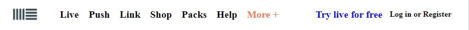

# SASS Knowledge

Basic knowledge of Sass and Example codes

Tutorial resource: [sass tutorial](https://www.w3schools.com/sass/sass_variables.php)

Example from the code: 

## Why using SASS?

1. Easier to manage large and complex CSS files
2. Features that does not exist in CSS: variables, mixins, imports,...

## How does SASS work?

Browser does not understand SASS code, therefore we need to compile it into CSS code

# SASS Basics

## I. Variables

With this feature, we can re-use variables later without re-typing everything

We can store information like strings, numbers, booleans, nulls, lists, and colors

Sass use `$` follow by a name to declare a variable

```scss
$primary-font-size: 10px;
```

After declaration, variables could be used normally

```scss
$primary-font-size: 10px;

p {
  font-size: $primary-font-size;
}
```

> Note: Sass variables are only valid inside the block they are declared <br>
> If want to use it outside that block, use: `!global`

```scss
$myColor: red;

h1 {
  $myColor: green !global;
  color: $myColor;
}

p {
  color: $myColor;
}

// this will change the color to green for p tag also
```

## 2. Nested

Example Code in Sass:

```scss
nav {
  ul {
    margin: 0;
    padding: 0;
    list-style: none;

    li {
      display: inline-block;
    }
  }
}
```

This means that `ul` is the child of `nav` and `li` is the child of `ul`

Without nested feature, we will have to code like this in CSS:

```css
nav ul {
  margin: 0;
  padding: 0;
  list-style: none;
}
nav ul li {
  display: inline-block;
}
```

### Special Properties

Many CSS properties have the same prefixes, like font-family, font-size, or text-align, text-transform

With Sass Nested feature, we can simplify them by writing:

```scss
font {
  family: Helvetica, sans-serif;
  size: 16px;
  weight: 800;
}
text {
  align: center;
  transform: lowercase;
}
```

which is similar to this code below in css

```css
font-family: Helvetica, sans-serif;
font-size: 18px;
font-weight: bold;

text-align: center;
text-transform: lowercase;
text-overflow: hidden;
```

## 3. Imports

Sass files could be imported as modules

Based on Sass mechanism, all file end in `.scss` will be transpiled, however, if adding `_` before the file name (`_example.scss`) the file will not be transpile directly until imported

Example:

"\_colors.scss":

```scss
$myPink: #ee82ee;
$myBlue: #4169e1;
$myGreen: #8fbc8f;
```

In the main `.scss` file:

```scss
@import "colors";

body {
  font-family: Helvetica, sans-serif;
  font-size: 18px;
  color: $myBlue;
}
```

## 4. Mixins

This feature allows us to create re-useable blocks of code (similar to functions)

Syntax:

```
@mixin name {
  property: value;
  property: value;
  ...
}
```

**Examples**

```scss
@mixin important-text {
  color: red;
  font-size: 25px;
  font-weight: bold;
  border: 1px solid blue;
}
```

using mixin code with `@include`

```scss
.danger {
  @include important-text;
  background-color: green;
}
```

which will output a CSS file:

```css
.danger {
  color: red;
  font-size: 25px;
  font-weight: bold;
  border: 1px solid blue;
  background-color: green;
}
```

We can also give mixins variables (like a function)

The parameters could also have some default values to avoid null input

```scss
@mixin bordered($color: blue, $width: 1px) {
  border: $width solid $color;
}

.myTips {
  @include bordered($color: orange);
}
```

## 5. Extends

This features help share common properties from one selector to another

```scss
.button-basic {
  color: red;
  margin: 20px;
}

.button-extend {
  @extend .button-basic;
  padding: 20px;
}
```

CSS output will be like:

```css
.button-basic,
.button-extend {
  color: red;
  margin: 20px;
}

.button-extend {
  padding: 20px;
}
```
